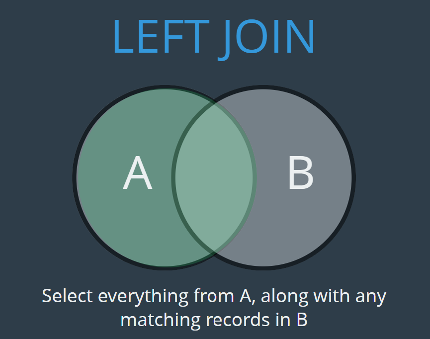

# MySQL Learning Note

## Basic Database Operations

### Enter MySQL client

```
mysql -uroot -p
```

### Display all databases

```
SHOW databases;
```

### Create a database

```
CREATE DATABASE <DB_NAME>;
```

### Delete a database

```
DROP DATABASE <DB_NAME>;
```

### Change a database

```
USE <DB_NAME>;
```

### Check current database

```
SELECT database();
```

## Table Operations

### Create a table

```
CREATE TABLE <TABLE_NAME>
    (
        <COLUMN_1> <DATATYPE_1>
        <COLUMN_2> <DATATYPE_2>
    );
```

For example:

```
CREATE TABLE limo
    (
        plate_number VARCHAR(15),
        type VARCHAR(50),
        passenger_seat INT
    );
```

Do not allow insertation of `NULL` values:

```
CREATE TABLE limo
    (
        plate_number VARCHAR(15) NOT NULL,
        type VARCHAR(50) NOT NULL,
        passenger_seat INT NOT NULL
    );
```

Set default value if not provided at insertation:


```
plate_number VARCHAR(15) DEFAULT "no_plate",
```

### Show all tables in a database

```
SHOW TABLES;
```

### Show columns in a table

```
SHOW COLUMNS FROM <TABLE_NAME>
```

Or:

```
DESC <TABLE_NAME>
```

### Manipulate column after creation

Modify `allow NULL` to `NOT NULL`: 

```
ALTER TABLE limo MODIFY passenger_seat INT NOT NULL;
```

## Primary Key

Primary key is the unique identifier for each row in the table.

`id` as primary key with auto-increment (1,2,3,...)

```
CREATE TABLE limo
    (
        vehicle_id INT NOT NULL AUTO_INCREMENT,
        plate_number VARCHAR(15) NOT NULL,
        type VARCHAR(50) NOT NULL,
        passenger_seat INT NOT NULL,
        PRIMARY KEY (vehicle_id)
    );
```

## Insert Data to Table

### Single entry

```
INSERT INTO limo(plate_number,type,passenger_seat)
VALUES('OF8571','Honda Odyssey',7);
```

### Multiple entries

```
INSERT INTO limo(plate_number,type,passenger_seat)
VALUES('BN863','Honda Odyssey',7),
('BK7659','Honda Odyssey',7),
('NJ9683','Honda Odyssey',7);
```

## Select Entries from Table

### Select all rows with `cat_id` and `name` columns only

```
SELECT cat_id, name FROM cat;
```

### Select filtered rows

```
SELECT * FROM cat WHERE age=4;
SELECT * FROM cat WHERE age>4;
```

### Select with alias for column name

When combining multiple tables, we want the column name to be unified. An alias can be added when selecting the data:

```
SELECT cat_id AS id, name FROM cat;
```

## Update Entry

```
UPDATE cat SET age=8 WHERE name="Egg";
```

## Delete Entry

### Delete specific row

```
DELETE FROM cat WHERE name="Egg";
```

### Delete all rows in the table

```
DELETE FROM cat;
```

## Run SQL File

Write SQL codes in a `.sql` file

```
USE <DB_NAME>;

SOURCE <SQL_FILE_NAME>;
```

## MySQL String Functions

### Concat

```
SELECT CONCAT(author_fname," ",author_lname) AS author_fullname, title FROM books;
```

Returns this:

```
+----------------------+-----------------------------------------------------+
| author_fullname      | title                                               |
+----------------------+-----------------------------------------------------+
| Jhumpa Lahiri        | The Namesake                                        |
...
```

### Concat with separator

```
SELECT CONCAT_WS(' - ', title, author_fname, author_lname) FROM books;
```

Returns this:

```
+------------------------------------------------------------------------+
| CONCAT_WS(' - ', title, author_fname, author_lname)                    |
+------------------------------------------------------------------------+
| The Namesake - Jhumpa - Lahiri                                         |
...
```

### Substring

Note: in SQL, string index start with `1`

```
SELECT SUBSTRING(plate_number,-4) AS plate_last_four FROM limo;
SELECT SUBSTR(plate_number,-4) AS plate_last_four FROM limo;
```

`SUBSTR` and `SUBSTRING` will have the same effect

### Replace

```
SELECT REPLACE('HellO World', 'o', '*');
```

### Reverse

```
SELECT REVERSE("TEXT TO REVERSE");
```

## Aggregation Functions

### Count 

#### Count number of rows

```
SELECT COUNT(*) FROM books;
```

#### Count unique rows

```
SELECT COUNT(DISTINCT author_fname) FROM books;
```

#### Count unique (multiple fields)

```
SELECT COUNT(DISTINCT author_fname,author_lname) FROM books;
```

This is equivalent to:
```
SELECT COUNT(DISTINCT CONCAT(author_fname,author_lname)) FROM books;
```

### Group by

Group several rows together by a shared property

Get the number of books written by each author:

```
SELECT CONCAT(author_fname,author_lname) AS fullname,COUNT(*) FROM books GROUP BY CONCAT(author_fname,author_lname);
```

Returns this:

```
+-----------------------------------+----------+
| fullname                          | COUNT(*) |
+-----------------------------------+----------+
| JhumpaLahiri                      |        2 |
| NeilGaiman                        |        3 |
...
```

This is equivalent to:

```
SELECT CONCAT(author_fname,author_lname) AS fullname,COUNT(*) FROM books GROUP BY author_fname,author_lname;
```

### Min & Max

Get minimum:

```
SELECT MIN(released_year) FROM books;
```

Get maximum:

```
SELECT MAX(released_year) FROM books;
```

### Sum

Aggregates spendings by each customer:

```
SELECT customer_id, SUM(amount) FROM orders
    GROUP BY customer_id;
```

## Advanced Selection

### Match pattern

Select `limo` with plate number starting with `B`:

```
SELECT * FROM limo WHERE plate_number LIKE "B%"
```

- `LIKE "B%"`: Starting with `B`
- `LIKE "%B%"`: Including `B`
- `LIKE "%B"`: Ending in `B`

### Check NULL

```
SELECT * FROM client WHERE agent IS NULL;
``` 

### Check membership

Check whether an entry is included in another table.

If not included, return True:

```
SELECT employee_id FROM Employees 
    WHERE employee_id NOT IN (SELECT employee_id FROM Salaries)
```

If included, return True:

```
SELECT employee_id FROM Employees 
    WHERE employee_id NOT IN (SELECT employee_id FROM Salaries)
```

Note: this will only work if the table after `NOT IN` has only one column, which is the one we wish to check.

### Selection with subquery (nested queries)

```
SELECT * FROM orders WHERE customer_id = 
    (SELECT id FROM customers WHERE first_name="BOY");
```

Problems:

- Only work if the subquery returns one value
- Unable to concat multiple tables (from the code above, we can only see the information in the `orders` table)

## Two Table Operations

### Union


We have to tables, `Employees` and `Salaries`, we wish to get the `employee_id` that appears in one table but no in the other.

```
SELECT employee_id FROM Employees WHERE employee_id NOT IN (SELECT employee_id FROM Salaries)
UNION 
SELECT employee_id FROM Salaries WHERE employee_id NOT IN (SELECT employee_id FROM Employees)
ORDER BY employee_id;
```

(Refer to question 1965 from Leetcode)

## Data Relationships

- One-One

    For example, `user` and `review`, as one user can only leave review once, and a unique review can be traced back to a specific user.

- One-Many

    For example, `book` and `review`, as one book could have thousands of reviews, but all the reviews are for a specific books.
    
- Many-Many

    For example, `author` and `book`, as one author can write multiple books and one book can be written by multiple authors.
    
Foreign key: establish the association between separated tables.

Primary key: make the rows in each table is unique.

### Foreign Key

Analyze this code:

```
CREATE TABLE orders(
    id INT AUTO_INCREMENT PRIMARY KEY,
    order_date DATE,
    amount DECIMAL(8,2),
    customer_id INT,
    FOREIGN KEY(customer_id) REFERENCES customers(id)
);
```

- Foreign key has to be specified when creating the table
- `customers(id)` means the foreign key is linked to the `id` title in `customers` table
- There will be a failure if we try to add a row to `orders`, where `customer_id` does not exist as `id` in `customers`

### Cross join

Cross-joining table `customers` and `orders`:

```
SELECT * FROM customers, orders;
```

For example, we have table `A` and `B`.

Cross join will concat each row in `A`, to all rows in `B`.

Contents in `A`:

TitleA1|TitleA2
---|---
A1-1|A1-2
A2-1|A2-2
A3-1|A3-2
A4-1|A4-2
A5-1|A5-2

Contents in `B`:

TitleB1|TitleB2
---|---
B1-1|B1-2
B2-1|B2-2
B3-1|B3-2
B4-1|B4-2
B5-1|B5-2

After joining:

TitleA1|TitleA2|TitleB1|TitleB2
---|---|---|---
A1-1|A1-2|B1-1|B1-2
A1-1|A1-2|B2-1|B2-2
A1-1|A1-2|B3-1|B3-2
A1-1|A1-2|B4-1|B4-2
A1-1|A1-2|B5-1|B5-2
A2-1|A2-2|B1-1|B1-2
...|...|...|...

### Inner join

Instead of simply joining the rows horizontally, we can join the rows where certain key is matched.


```
SELECT * FROM customers
    JOIN orders ON orders.customer_id = customers.id;
```

Returns this:

```
+----+------------+-----------+------------------+----+------------+--------+-------------+
| id | first_name | last_name | email            | id | order_date | amount | customer_id |
+----+------------+-----------+------------------+----+------------+--------+-------------+
|  1 | Boy        | George    | george@gmail.com |  1 | 2016-02-10 |  99.99 |           1 |
|  1 | Boy        | George    | george@gmail.com |  2 | 2017-11-11 |  35.50 |           1 |
|  2 | George     | Michael   | gm@gmail.com     |  3 | 2014-12-12 | 800.67 |           2 |
|  2 | George     | Michael   | gm@gmail.com     |  4 | 2015-01-03 |  12.50 |           2 |
|  5 | Bette      | Davis     | bette@aol.com    |  5 | 1999-04-11 | 450.25 |           5 |
|  4 | Blue       | Steele    | blue@gmail.com   |  6 | 2019-05-10 | 850.00 |           4 |
+----+------------+-----------+------------------+----+------------+--------+-------------+
```

Inner join with `GROUP BY`:

```
SELECT first_name,last_name,SUM(amount) FROM customers 
    JOIN orders ON orders.customer_id = customers.id
    GROUP BY first_name, last_name;
```

Returns this:

```
+------------+-----------+-------------+
| first_name | last_name | SUM(amount) |
+------------+-----------+-------------+
| Boy        | George    |      135.49 |
| George     | Michael   |      813.17 |
| Bette      | Davis     |      450.25 |
| Blue       | Steele    |      850.00 |
+------------+-----------+-------------+
```

### Left join

Anything from the left side, plus all overlapped information.



```
SELECT first_name, last_name, order_date, amount FROM customers
    LEFT JOIN orders ON orders.customer_id = customers.id;
```

Returns this:

```
+------------+-----------+------------+--------+
| first_name | last_name | order_date | amount |
+------------+-----------+------------+--------+
| Boy        | George    | 2017-11-11 |  35.50 |
| Boy        | George    | 2016-02-10 |  99.99 |
| George     | Michael   | 2015-01-03 |  12.50 |
| George     | Michael   | 2014-12-12 | 800.67 |
| David      | Bowie     | NULL       |   NULL |
| Blue       | Steele    | 2019-05-10 | 850.00 |
| Bette      | Davis     | 1999-04-11 | 450.25 |
+------------+-----------+------------+--------+
```

Left join with `GROUP BY`:

```
SELECT first_name, last_name, IFNULL(SUM(amount),0) AS total_spending FROM customers 
    LEFT JOIN orders ON customers.id = orders.customer_id 
    GROUP BY first_name, last_name 
    ORDER BY total_spending;
```

`IFNULL()` function accepts 2 arguments, the first will be returned if the field is not `NULL`, the second will be returned in case it is `NULL`.

Returns this:

```
+------------+-----------+----------------+
| first_name | last_name | total_spending |
+------------+-----------+----------------+
| David      | Bowie     |           0.00 |
| Boy        | George    |         135.49 |
| Bette      | Davis     |         450.25 |
| George     | Michael   |         813.17 |
| Blue       | Steele    |         850.00 |
+------------+-----------+----------------+
```

### Right join

Anything from the right side, plus all overlapped information.


### On delete cascade

Due to the property of `FOREIGN KEY`, it is non-trivial to delete a customer, who has order history.

The solution is to set on delete cascade to the `orders` table. Therefore, when we attempt to delete a customer, the associated orders will
also be deleted automatically.

```
CREATE TABLE orders (
    id INT PRIMARY KEY AUTO_INCREMENT,
    order_date DATE,
    amount DECIMAL(8 , 2 ),
    customer_id INT,
    FOREIGN KEY (customer_id)
        REFERENCES customers (id)
        ON DELETE CASCADE
);
```